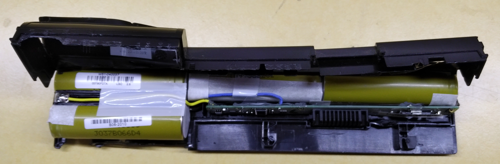
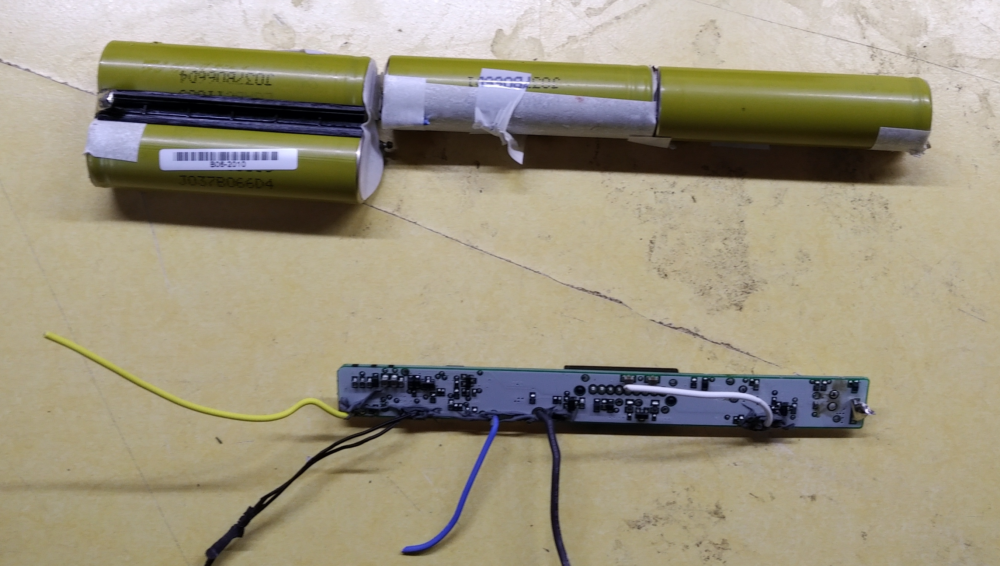
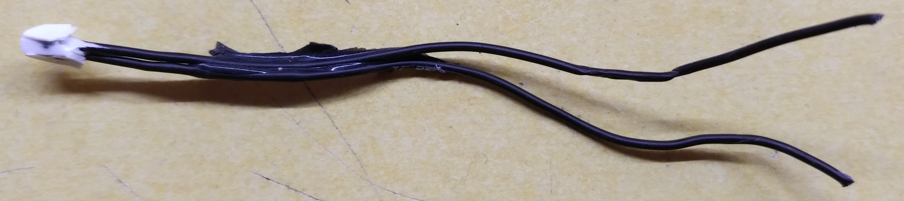
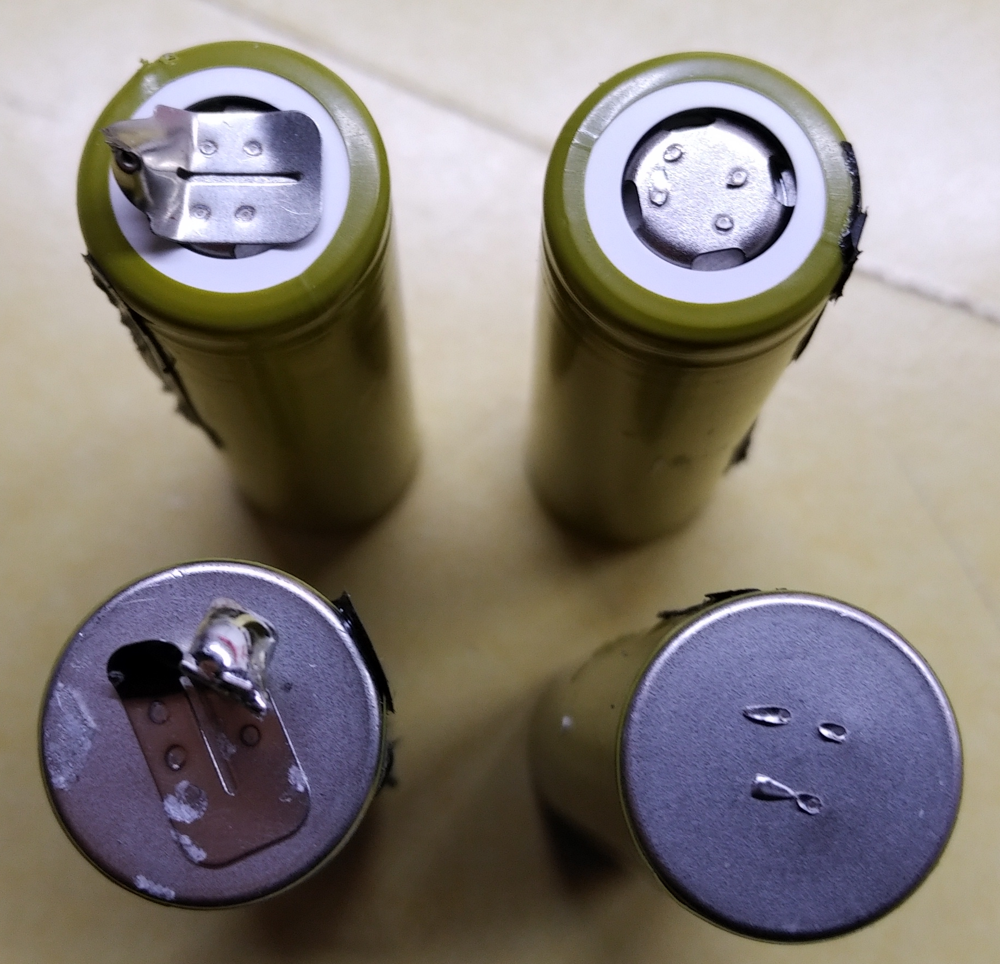

# Akkus schlachten

Für viele Projekte eignen sich hervorragend die 18650er Akkus welche beinahe überall verbaut sind (Laptopakkus, E-Bikes, Elektroautos, E-Zigaretten, Powerbanks, etc). Hier möchten wir zeigen wie man die Zellen sicher entfernt. Beim Umgang mit Lithium-Akkus ist Vorsicht geboten! Diese sind hochgiftig und können brennen oder explodieren. Bitte seid vorsichtig und verwendet Schutzausrüstung (Handschuhe, Schutzbrille)! Am häufigsten wirst du Laptop Akkus finden, diese haben meist hochwertige Zellen verbaut und lohnen sich deshalb zu schlachten.

## Akkus öffnen 
Wenn du nun einen Akku hast aus dem du die Zellen entfernen möchtest öffnest du vorsichtig, am besten mit Kunststoffwerkzeug die verschlossenen Ränder eines Akkus, arbeite nicht mit Gewalt, damit kannst du die Zellen beschäden oder Kurzschlüsse verursachen. Dann biegst du das Gehäuse vorsichtig auf wie im Bild gezeigt.

{#id .class width=600}

## Zellen entfernen
Wenn das Gehäuse offen ist kannst du vorsichtig die Zellen entnehmen, diese sollten sich ohne viel Mühe lösen lassen, ansonsten musst du schauen ob die Zellen mit Kleber oder durch Kunststoffstege gehalten wirst.

{#id .class width=600}

## Ladeelektronik entfernen
Nun kann man die Ladeelektronik des Akkus mit dem Seitenschneider entfernen. Alle Kabel einzeln trennen, niemals mehrere Kabel zusammen durchschneiden, das führt zum Kurzschluss, das macht Akku, Seitenschneider und Menschen kaputt!

{#id .class width=600}

In den meisten Akkus findest du einen Thermistor, das ist ein Widerstand dessen Wert sich Temperaturabhängig ändert. Diesen kannst du aufheben um die Temperatur zu messen, dazu musst du diesen nur an einen Analog Pin eines ESPs oder Arduinos anschließen.

{#id .class width=600}

## Zellen trennen
Trenne jetzt die Zellen auseinander und enferne die Lötstreifen. Diese sind normalerweiße an 4 Punkten auf den Akku geschweißt. Je sauberer du die Reste entfernst desto leichten tust du dir später mit dem anbringen neuer Lötstreifen. Wenn deine Schweißpunkte wie rechts aussehen hast du alles richtig gemacht.

{#id .class width=600}

Entferne nicht die Isolierung der Akkus, da du sonst leicht einen Kurzschluss verursachen kannst. Außerdem kannst du dann die Bezeichnung des Akkus nicht mehr lesen.

{#id .class width=600}

## Zum Schluss
Mülltrennung ist toll! Die Elektronik gehört nicht in den Restmüll und der Kunststoff wohnt in der gelben Tonne!

{#id .class width=600}

## Weitere Hinweise
Miss alle Zellen bevor du Sie verwendest!
:   Wenn deine Zelle weniger als 3,3V hat entsorge diese. Sie ist tiefentladen und gefährlich. Eine leere Zelle hat 3,7V, Zellen die deutlich darunter liegen können beim Lagern oder laden zu brennen anfangen oder explodieren.

Verwende eine Schutzabschaltung!
:   Aus dem zuvor genannten Punkt ist es wichtig die Tiefentladung zu vermeiden. Dies kannst du durch Module machen die du zwischen akku und Verbraucher hängst, diese kosten oft nur wenige Cent.

Verwende ein passendes Ladegerät!
:   Lithium Akkus sollte man immer mit einem dafür vorgesehenen Ladegerät laden. Dies garantiert dir die beste Leistung und längste Lebenszeit deines Akkus.

Benutze einen Balancer!
:   Um Lithium Akkus zu laden solltest du ein Ladegerät verwenden dass jede Zelle einzeln überwacht und anpasst.

Schließe keine Akkus verschiedenen Typs zusammen! 
:   Diese haben meist eine Unterschiedliche Kapazität.
