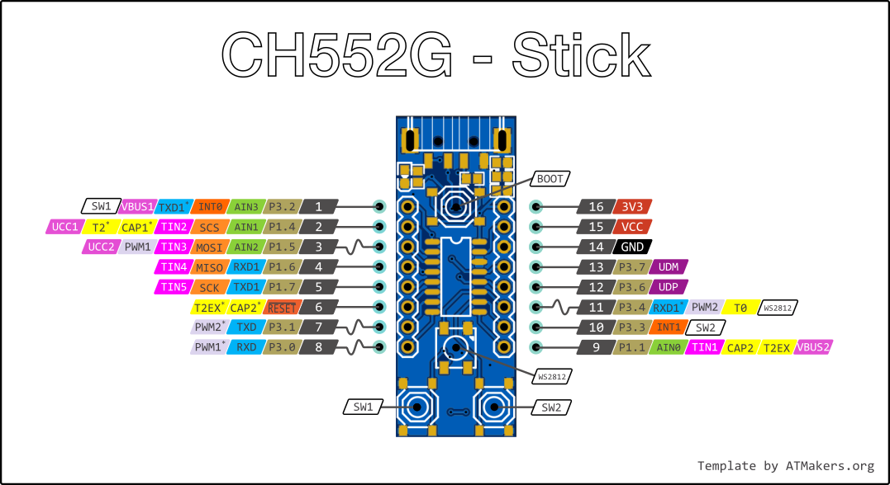

# Der CH552

hier werden Informationen für den CH552 Stick hinterlegt. (Wird kontinuierlich erweitert)

**Features:**

* Erweiterter 8051 CPU, 8-15 mal schneller (Interner 24MHz Oszillator PLL)
* 16KB Code Flash, 1KB xRAM, 256B iRAM, 128B DataFlash R/W 
* BootLoader zur Programmierung über USB
* USB Controller für Device Mode, USB 2.0 full speed 12MB/s oder low speed 1,5MB/s (via DMA)
* 3 Timer/Counter für z.B. 2 PWM Ausgänge
* 2 UARTs (Serielle)
* 1 SPI Master/Slave
* 4 8-Bit A/D-Wandler
* 6 Touch Eingänge

[Datenblatt Chinesisch](https://datasheet.lcsc.com/szlcsc/2008191734_WCH-Jiangsu-Qin-Heng-CH552G_C111292.pdf)
[Deutsch über Google-Translate](https://translate.google.com/translate?sl=auto&tl=de&u=https://datasheet.lcsc.com/szlcsc/2008191734_WCH-Jiangsu-Qin-Heng-CH552G_C111292.pdf)

Lesenswerte Einführung von Aaron: [ATCnetz.de](http://atcnetz.blogspot.com/2019/02/ch552-020-mikrocontroller-mit-usb.html)

## Software (Compiler)
### Arduino
Der CH552 ist über Arduino am einfachsten zu Programmieren, es wird aber eine Board-Erweiterung benötigt und es sind nicht alle Arduino Funktionen möglich.
Hier der Link zur [Board-Erweiterung mit Beschreibung](https://github.com/DeqingSun/ch55xduino). Diese enthält auch einige Beispiele.

## Boards
### V0.1 Test-Stick

#### Belegung
* P3.2 = Taste 1
* P3.3 = Taste 2
* P3.4 = WS2812
* Bootloader Taste (nahe USB-Port)

### Weitere Projekte
* Open-source CH55x flashing tool, SDK.... [rgwan/librech551](https://github.com/rgwan/librech551)
* CH55x USB to JTAG bridge [diodep/ch55x_jtag](https://github.com/diodep/ch55x_jtag)
* CH552 Dual USB to Serial Bridge [diodep/ch55x_dualserial](https://github.com/diodep/ch55x_dualserial)
* CH551 to CH554 One Click SDCC Compiler [atc1441/CH55xOneClickCompiler](https://github.com/atc1441/CH55xOneClickCompiler)
* [Android: CH55x Programmer V2](https://play.google.com/store/apps/details?id=com.atcnetz.de.ch55xprogrammerV2&hl=gsw&gl=US)
