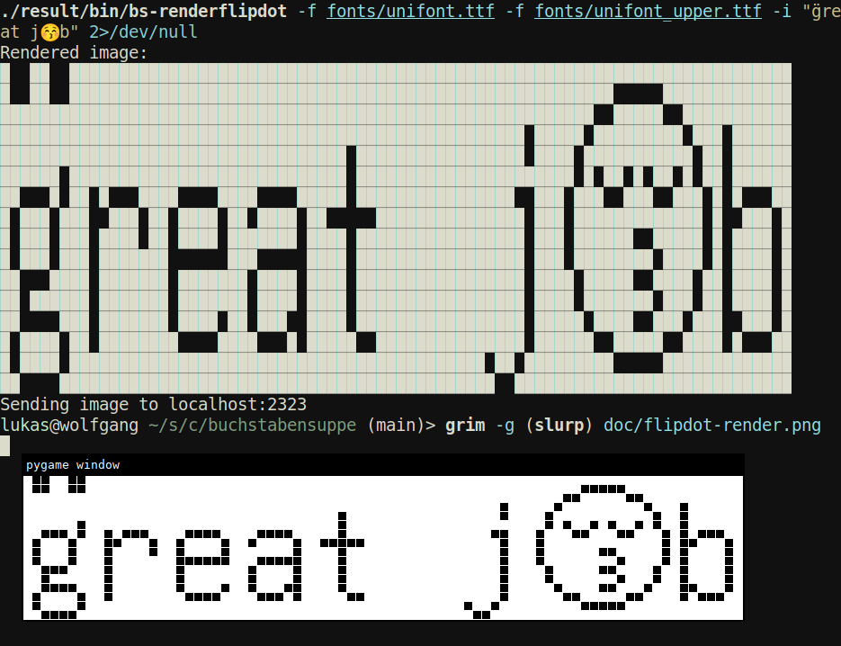

* [Kümmerer](Kümmerer#flipdots)

Die Flipdots sind eine Teile einer ehemalige P&R-Anzeige aus München, die wir vom μCCC bekommen haben. Das Display kann 80 mal 16 Schwarz-Weiß-Pixel anzeigen, wobei jeder Pixel elektromagnetisch ge*flip*ped wird zwischen schwarzen und weißen Zustand — daher auch der Name.

Die Flipdots stehen auf dem [Regal](Regal). Strom ist in der Mehrfachsteckdose über der Musikanlage beim Schallplattenspieler und hannswurst eingesteckt. LAN steckt in Buchse 14 (ist hinter Kisten).

Ein- und Ausgeschaltet können die Flipdots per Schalter an der Mehrfachsteckdose *direkt* an den Flipdots.

## Ansteuerung

### Per UDP-Schnittstelle

* Erreichbar auf `flipdot.lab`, Port 2323

### Per flipdot-gschichtler (Web-Interface oder API)

* [flipdot.openlab-augsburg.de](http://flipdot.openlab-augsburg.de)
* [API-Dokumentation](https://github.com/openlab-aux/flipdot-gschichtler#api-documentation)

## Client-Software und Tools

### flipdots script

Der `scripts` Ordner des allgemeinen flipdots Repositories enthält eine ganze Reihe von verschiedener Client-Software für die Flipdots.

Die meisten Skripte sind noch für Python 2.7 geschrieben (sollten wir mal bald™ auf 3.x portieren) und haben den Hostname der Flipdots im OpenLab hardgecodet irgendwo.

Es gibt alles von statischen Animationen (wie `invaderflip.py`), Simulationen (wie `golflip.py`) zu Spielen (wie `snake`).

* [Code auf GitHub](https://github.com/openlab-aux/flipdots/tree/master/scripts)
* [μCCC Variante](https://github.com/muccc/flipdots/tree/master/scripts) (ein paar Sachen, die nicht in unserem Repo sind, aber mit anderem Hostname und auf andere Dimensionen ausgelegt!)

### FlipdotAPI

Der `scripts`-Ordner enthält auch eine Python-„Library“, um mit den Flipdots zu interagieren: [FlipdotAPI](https://github.com/openlab-aux/flipdots/tree/master/scripts/FlipdotAPI)

### buchstabensuppe

buchstabensuppe ist eine Library, die ausgefeilteres font rendering implementiert als `PIL.ImageFont`, was die meisten flipdots Python-Skripte benutzen.
Daneben gibt es auch (noch recht spärlichen) Support-Code, um mit den Flipdots zu interagieren.

Zusätzlich enthält es das tool `bs-renderflipdot`, mit dem man Strings auf die flipdots rendern kann:

* [Code auf GitHub](https://github.com/sternenseemann/buchstabensuppe)
* [Doku zum Thema Flipdots](https://github.com/sternenseemann/buchstabensuppe/blob/main/README.md#flipdot-interaction)
* [bs-renderflipdot man page](https://sternenseemann.github.io/buchstabensuppe/man/bs-renderflipdot.1.html)
* Mit `nix`: `nix run -f https://github.com/sternenseemann/buchstabensuppe/archive/main.tar.gz`

### flong

`flong` ist eine Pong-Implementation für zwei Spieler, die das flipdot als Display benutzt. Wurde vermutlich zuletzt auf dem LIT 2017 gespielt, müsste aber noch funktionieren.

* glaxx' [Code auf GitHub](https://github.com/glaxx/flong)

### flipdotsim

`flipdotsim` stellt die Flipdot-UDP-Schnittsteller auf einem lokalen Rechner bereit und simuliert den Flipdot-Output in einem Pygame-Fenster. Das ist recht praktisch, wenn man eigene Scripts für das Flipdot entwickelt und sie testen möchte.

* [Code / Download auf GitHub](https://github.com/openlab-aux/flipdotsim/blob/master/flipdotsim.py)
* Mit `nix`: `nix run -f "https://github.com/openlab-aux/flipdotsim/archive/master.tar.gz" -c flipdotsim`

## Deployment

Auf dem Raspberry Pi laufen diese drei relevanten [systemd](http://systemd.org/)-services:

Service                           Beschreibung                                                                          Source-Code
--------------------------------  ----------------------------------------------------------------------------------    ------------
`flipdot.service`                 Empfängt die Steuerungspakete per UDP auf Port 2323                                   [flipdots](https://github.com/openlab-aux/flipdots/tree/master/raspberrypi)
`flipdot-gschichtler.service`     Fragt regelmäßig die Queue der Web-API ab und schickt neuen Text auf die Flipdots     [flipdot-gschichtler/anzeigetafel](https://github.com/openlab-aux/flipdot-gschichtler/tree/master/anzeigetafel)
--------------------------------  ----------------------------------------------------------------------------------    ------------

Auf einem Server von [sternenseemann](Mensch_sternenseemann) läuft [flipdot-gschichtler/warteraum](https://github.com/openlab-aux/flipdot-gschichtler/tree/master/warteraum)
und das [web interface](https://github.com/openlab-aux/flipdot-gschichtler/tree/master/bahnhofshalle).

### Setup-Anleitung flipdot daemon auf dem Raspberry Pi

Läuft auf dem Raspberry Pi (`flipdot.lab`), der auf der Rückseite montiert ist.

User    Passwort
------- --------
flipdot flipdot
root    openlab
------- --------

Services laufen nach Möglichkeit als `flipdot`, in `/home/flipdot` liegt der source code.

#### Setup-Prozess

1. `apt install git build-essential`, repos clonen
2. [bcm2836](http://www.airspayce.com/mikem/bcm2835/) installieren
5. `apt install fonts-dejavu unifont`
3. In `flipdots/raspberry` `make` ausführen und binaries nach `/opt/flipdot/` kopieren
4. systemd services nach `/etc/systemd/system` kopieren, anpassen und starten
