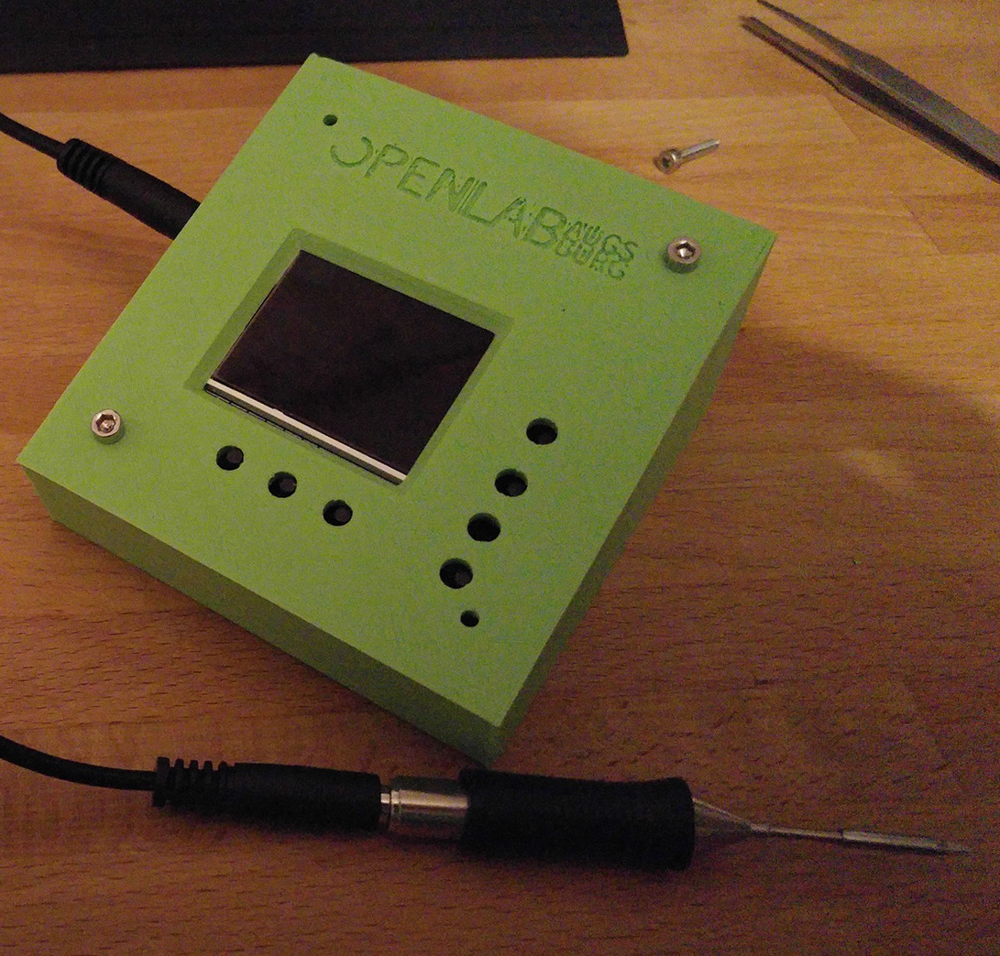
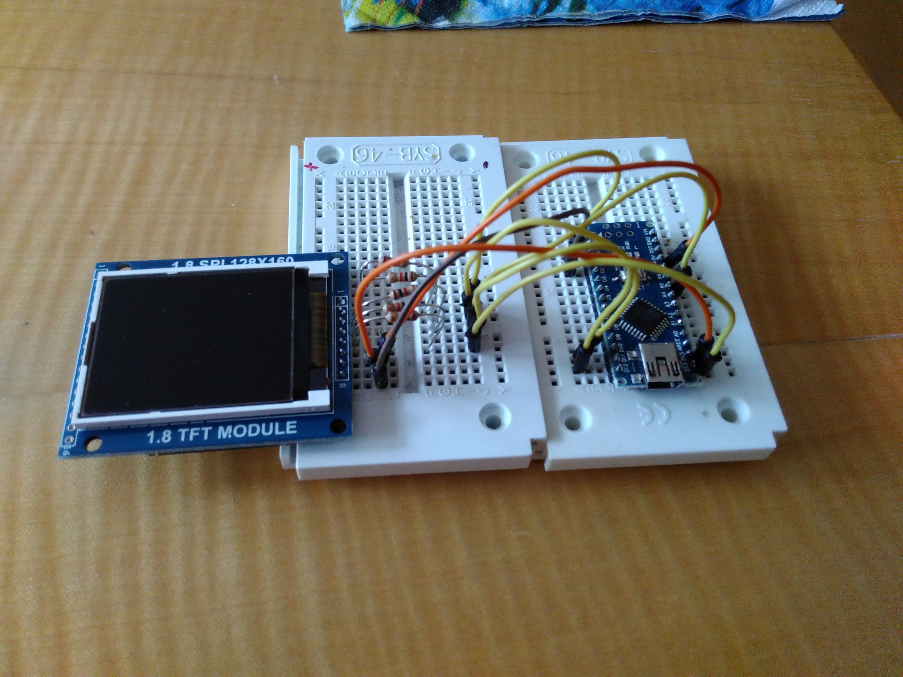
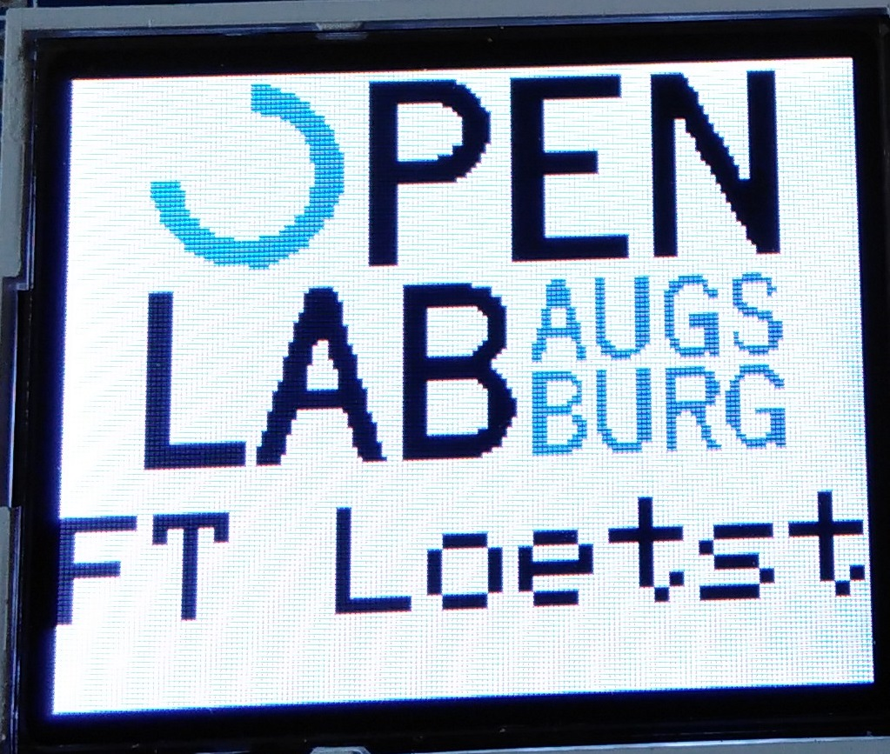
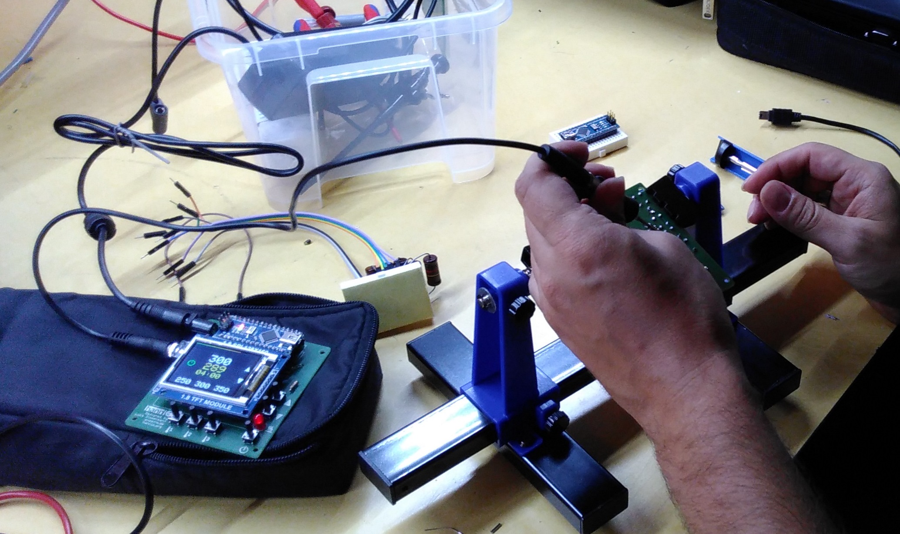
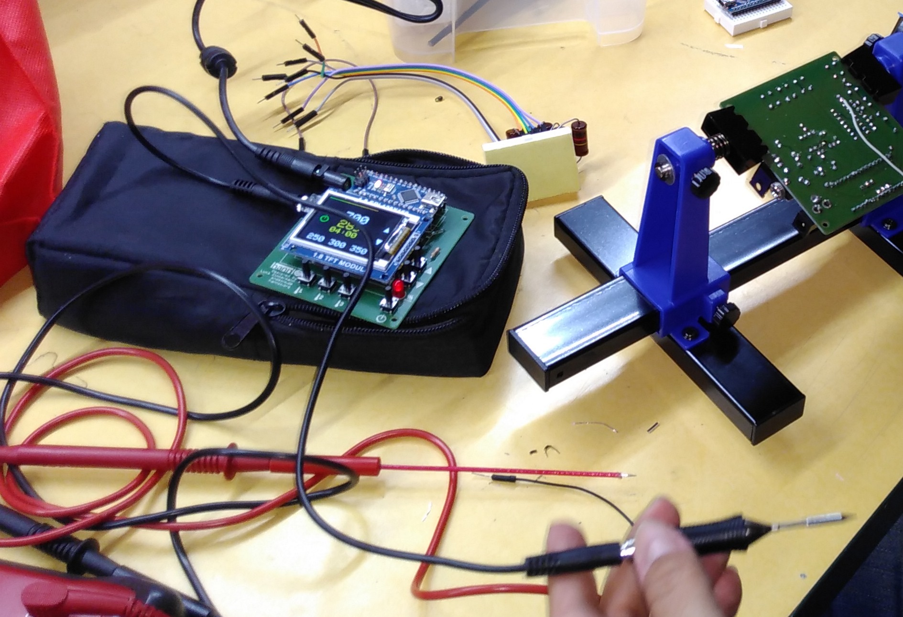
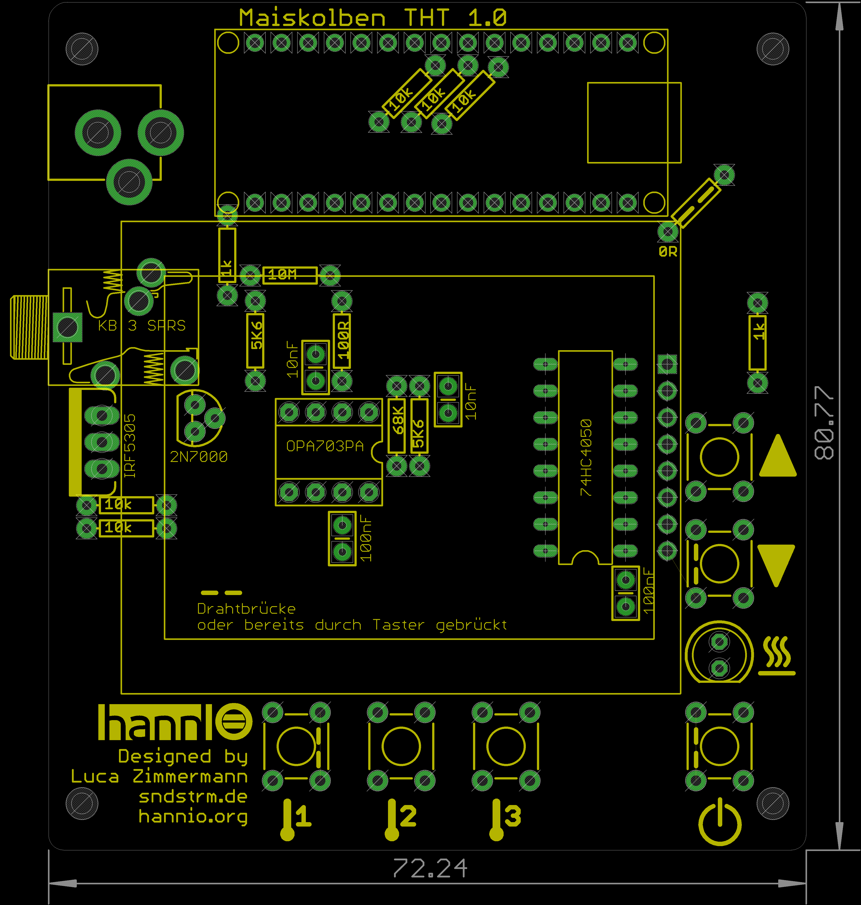

#Bau' Dir eine eigene Lötstation

## Vorgeschichte

In der [Make 5/2016 Seite 12ff](http://www.heise.de/make/inhalt/2016/5/12/) wurde eine Lötstation zum Selberbauen vorgestellt. Sie basiert auf einem Arduino Nano, einem 1,8" TFT Display und einer Weller RT Lötspitze. Der Arduino übernimmt die Ausgaben auf dem Display, regelt die Lötspitzentemperatur und bietet dem Anwender über zwei Tasten ein Benutzerinterface zum Einstellen der Solltemperatur. Weitere Taster wählen vorkonfigurierte Temperaturen an bzw. schalten Ein/Aus oder in Standby mit reduzierter Temperatur.

Es werden zusätzlich noch ein paar Widerstände, Kondensatoren, zwei MOSFETs und zwei ICs benötigt. Der eine IC verstärtkt den Temperaturmesswert, der andere führt eine Pegelanpassung auf 3,3V für das Display durch. Die Platinendateien und der Quellcode sind [hier](https://github.com/ArduinoHannover/Maiskolben) zu finden. Es werden ausschließlich bedrahtete Bauteile verwendet. Damit sollte jeder in der Lage sein, mit seinem *schlechten* Lötkolben diese Lötstation aufzubauen. 

Für das Gehäuse bietet sich 3D Druck an. Im Augenblick konstruiert Adrian ein Gehäuse. Der erste Prototyp sieht so aus:

{ width=800 }

## Bauteile

Anzahl Bauteil
------ ----------------
1      Platine
1      JP1: DC Einbaubuchse
1      TFT1: 1.8" TFT Display (128X160)
1      U1: Nano V3 ATmega328P Board, 5V/16MHz
1      Audio Verlängerungskabel 3,5mm Klinke
1      R1, R5: 1KΩ Widerstand (braun-schwarz-rot)
1      R7: 100Ω Widerstand (braun-schwarz-braun)
1      1/4W 100KΩ	Widerstand (braun-schwarz-gelb) (Dieser Widerstand ist im MAKE-Artikel parallel zum C8 im Schaltplan. Die Prototypen haben wir ohne aufgebaut. Bisher ohne Befund)
5      R3, R9, R10, R11, R12: 1/4W 10KΩ	Widerstand (braun-schwarz-orange)
1      R18: 1/4W 10MΩ Widerstand (braun-schwarz-blau)
1      1/4W 220Ω Widerstand (rot-rot-braun) (Dieser Widerstand ist im MAKE-Artikel für die LED vorgesehen, im Schaltplan zur Platine wird für die LED ein Widerstand mit 1kΩ benutzt)
2      R2, R8: 1/4W 5,6KΩ Widerstand (grün-blau-rot)
1      R4: 1/4W 68KΩ Widerstand (grün-grau-orange)
1      U1: 74HC 4050 Pegelwandler
4      1X10 2,54 Buchsenleiste
1      3,5mm Klinkenbuchse
2      C6, C8: 10nF Keramikkondensator
2      C1, C7: 100nF Keramikkondensator
1      LED: LED 5 mm rot
6      S1 - S6: Taster
1      IC1: OPA 703 PA	Operationsverstärker
1      Q2: N-Kanal 2N 7000	MOSFET
1      Q1: P-Kanal IRF 5305	MOSFET
1      WELLER RT 1	Lötspitze
1      Netzteil 60W 12V 5A

## Prototypenphase
Ähnlich wie bei den 3D-Druckern, kann man mit einer kleineren Menge erst mal Kosten sparen und ausprobieren, ob der Plan gelingt. Später lässt sich dann daraus ein Workshop basteln. Zur Vorbereitung habe ich 20 Platinen und alle Bauteile bestellt, die man für 5 Prototypen benötigt. Ebenso müsste es möglich sein, den Aufbau so zu gestalten, dass man nach jedem Schritt nachmessen können sollte, um Fehler frühzeitig zu finden.

Bis die Platinen da sind, kann man einen Teil der Lötstation auf einem Breadboard aufbauen, um z.B. an einer Einschaltmeldung herumzuspielen:

{ width=800 }

{ width=200 }

Inzwischen sind die Platinen eingetroffen. Bis gestern entstanden daraus 3 funktionierende Prototypen.

{ width=800 }

{ width=800 }

### Aufbau des Prototypen

{ width=800 }

Es gab natürlich ein paar Probleme beim Aufbau der Prototypen.

- Ein durchgebrannter Arduino Nano (falsch herum eingesteckt und dadurch an 12V Überspannung verstorben)
- Fehler auf der Platine (die 3,3V Verbindung vom Arduino Nano zum Pegelwandler existiert nicht; eine Drahtbrücke behebt dieses Problem)
- falsch eingelöteter Operationsverstärker (aus- und richtig herum wieder einlöten)
- Kontaktprobleme an der Buchsenleiste zum Display
- zu kleine Löcher für den Pegelwandler

Aber letztlich laufen die drei Lötstationen wie sie sollen. Die Erfahrungen aus dem Bau der drei Prototypen habe ich in die [Bauanleitung](Bauanleitung Lötstation.pdf) (Stand 10.11.2016) eingebaut. Derzeit bin ich dabei, die Firmware ein wenig anzupassen (Logo, PID-Konstanten ...) - die aktuelle Firmware (Stand 06.11.2016) ist [hier](Maiskolben_TFT.zip). Zur Visualisierung der Regelung kann man ein [Processing](https://processing.org/)-Sketch einsetzen. Dessen [Temperaturkurven](Maiskolben_GUI.zip) helfen, die richtigen P, I und D Werte zu finden.
