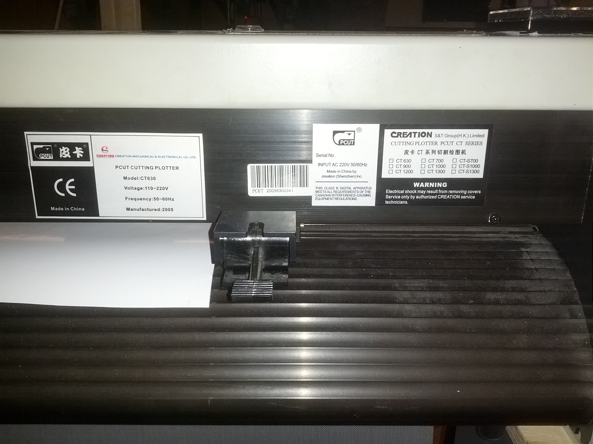

# Details zur Maschine

|Hersteller|PCUT|
|--|--|
|Model|CT630|

# Anschluss am Computer
# Software
## Inkscape
Für Inkscape existiert ein Plugin, mit dem es möglich ist, direkt aus Inkscape heraus zu plotten: Extensions → Export → Plot.

Eventuell muss pySerial nachinstalliert werden.

### 02.12.2017 
phjlipp und Coffee haben versucht, den Plotter anzusteuern. Diverse Permutationen der Schnittstellen-Einstellungen bewirkten nicht das gewünschte. Entweder blieb der Plotter völlig untätig, oder fuhr nur einen sehr kurzen Pfad ab, der nichts mit dem Inkscape-Pfad zu tun hatte.

|Serial Port|/dev/ttyUSB0|
|--|--|
|Serial Baud rate|19200|
|Serial Byte size|8 Bits|
|Serial Stop bits|1 Bit|
|Serial parity|None|
|Serial flow control|Hardware (RTS/CTS)|
|Command language|HPGL|

# Literaturhinweise
- [Schneidplotter im Fablab Karlsruhe](http://wiki.fablab-karlsruhe.de/doku.php?id=maschinen:schneidplotter)
