Dies sind die historischen [Haufen](../Haufen),

## Januar 2023: „Haufen der Dritte“

Am 05.01. wurde vom Plenum ein haufen gestartet, hier die zugehörige Kommunikation von phjl vom 06.01.:

> Hallo Gemeinschaft, wir haben gestern im Plenum beschlossen, dass wir einen Haufen starten, hier die Eckdaten und der Ablauf: 

> Phase 1 („sammeln“, 05.01.-22.01.); alle geben Zeug, das möglicherweise weg kann, auf den Haufen (der Haufen ist das markierte Gebiet im Sofaraum)

> Phase 2 („zurückholen“, 23.01.-10.02.); hier holt jeder seine eigenen Dinge wieder vom Haufen und beschriftet sie mit Owner Sticker, verräumt sie dann an einen sinnvollen Ort.

> Phase 3 („zu verschenken“, 10.02.-24.02.); hier kann jeder alles vom Haufen runter nehmen, z.B. mit nach Hause oder an einen sinnvollen Ort im Space verräumen (Owner-Sticker nicht vergessen)

> Phase 4 („Wegwerfen“; ab 25.02.); alles was dann noch über ist wird entsorgt bzw. zugunsten des Labs verscherbelt.

### Bilder

Hier der vollständigkeit halber einige (mehr oder weniger gute) Bilder. Es gilt trotzdem: Kommt vorbei und seht euch den Haufen selbst an!

## Oktober 2020: "Zweite Welle"
- Init: 2020-10-01, lustiger Name: Zweite Welle
	- Vorübergehende Fotos [im Chat, Channel: Räumlichkeiten](https://chat.openlab-augsburg.de/openlab/pl/k5m3xj4knirspg3irkrw7kntde)
- Freeze: 2020-10-14
	- Fotos werden am Freeze-Tag im Wiki eingefügt, Mail mit Link geht raus. 
- Free For All: 2020-10-28
- Sperrmülltag: 2020-11-12

## Historische Haufen

- Init: unklar
- Freeze: 01.02.2020
- Free For All: Ist der 2020 MV_Frühjahrs_Termin im März 2020 (vors.erste Märzhälfte) siehe MV  Ankündigung durch den Vorstand 
- Sperrmülltag: [ca. 2-3 Wochen nach der 1. MV 2020]

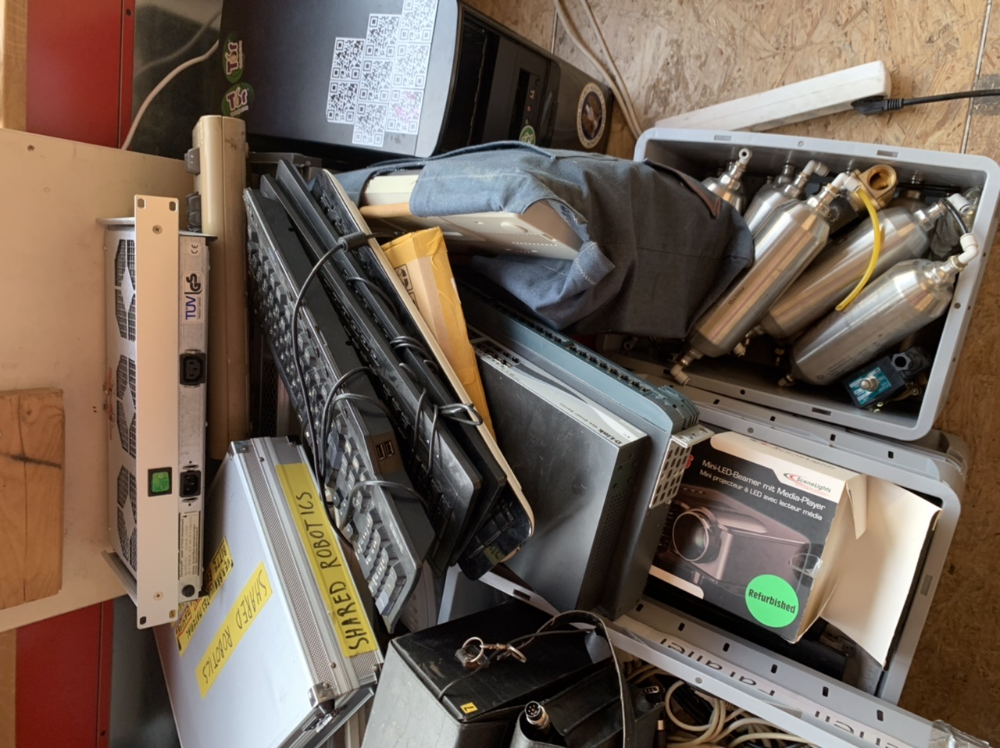
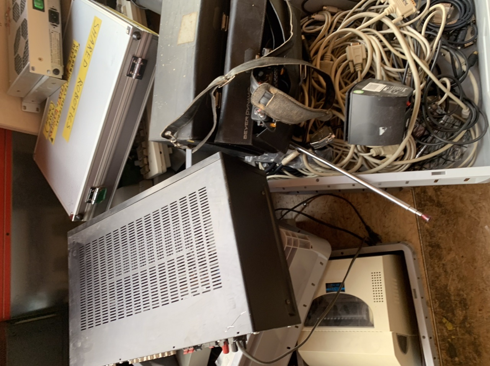
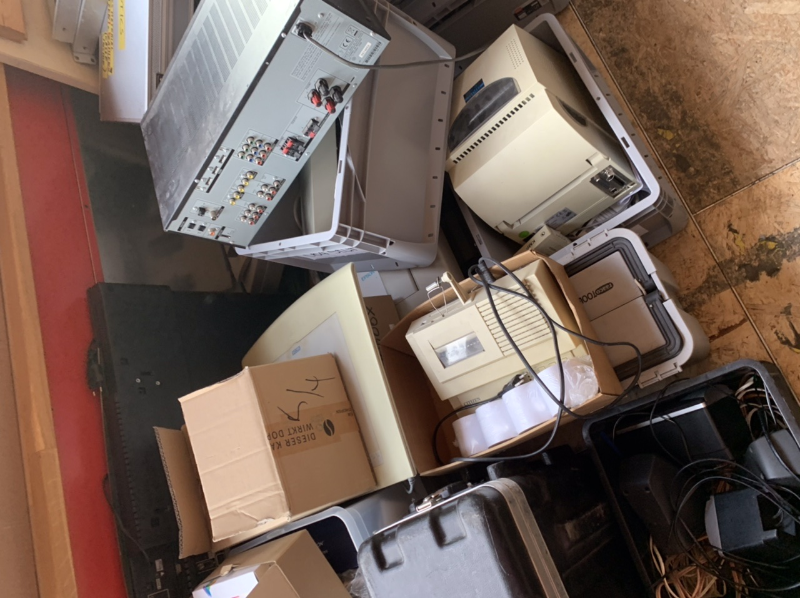

- Init: 11. August 2019
- Freeze: 18. August 2019
- Free For All: 2. September 2019
- Entsorgung: 10. September 2019

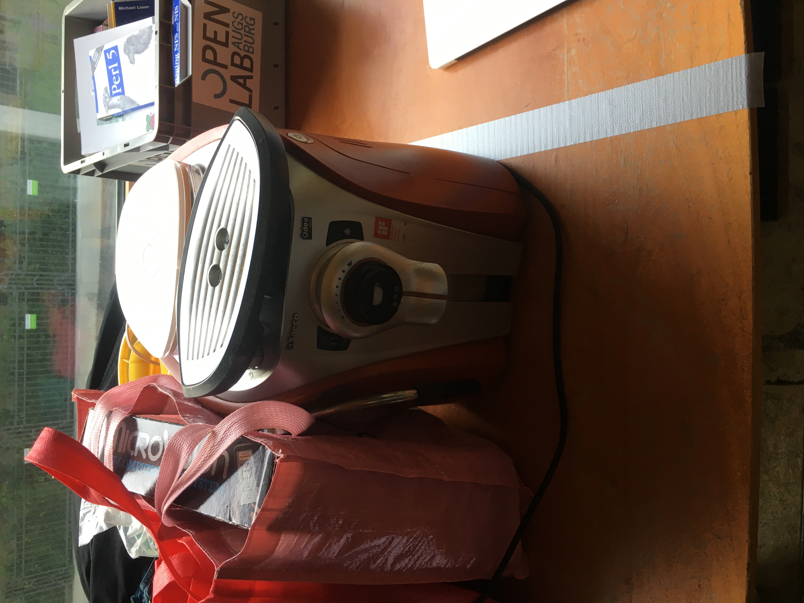{ width=50% }
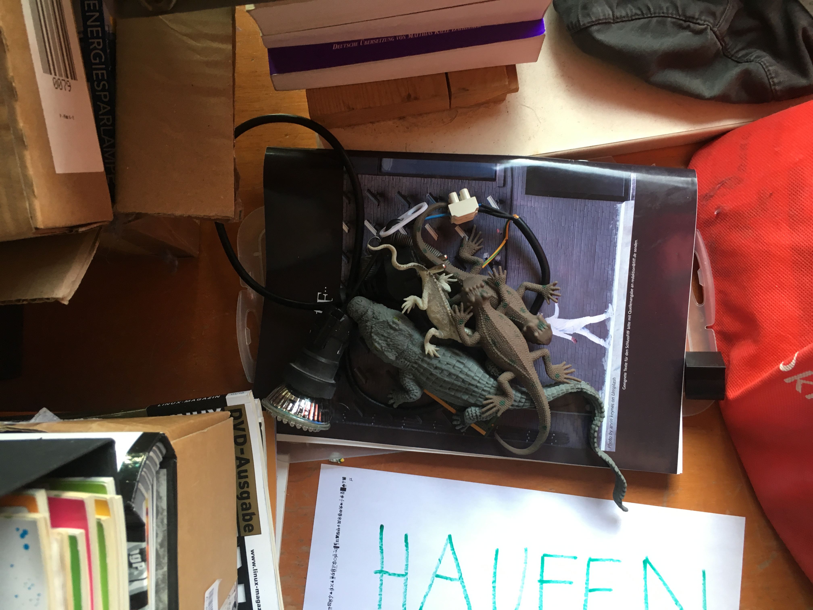{ width=50% }
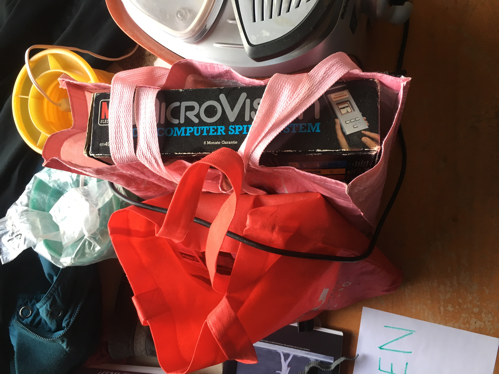{ width=50% }
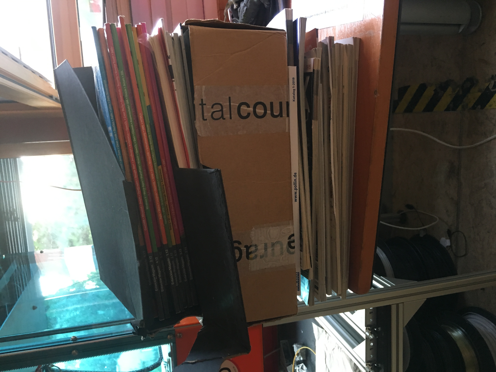{ width=50% }
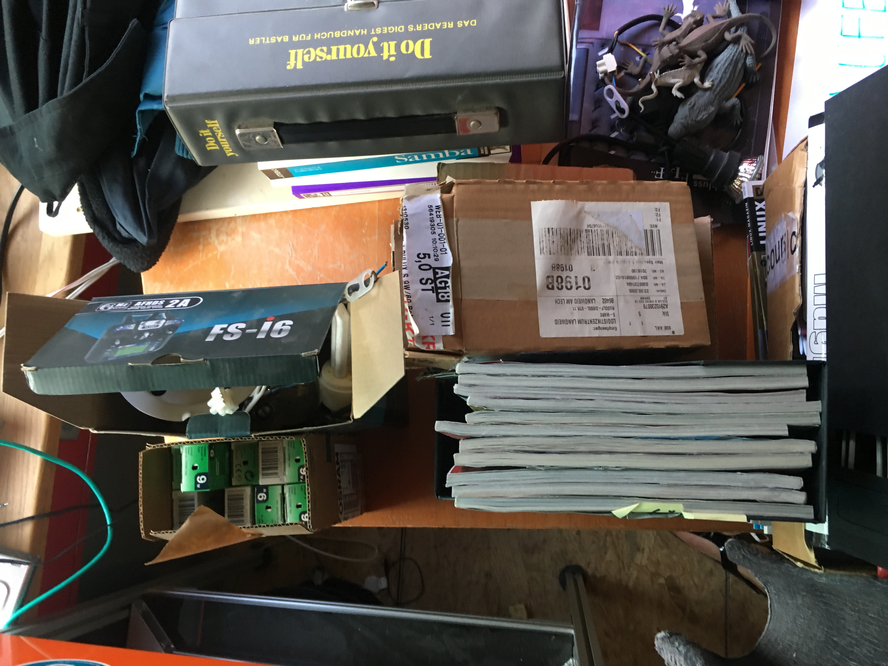{ width=50% }
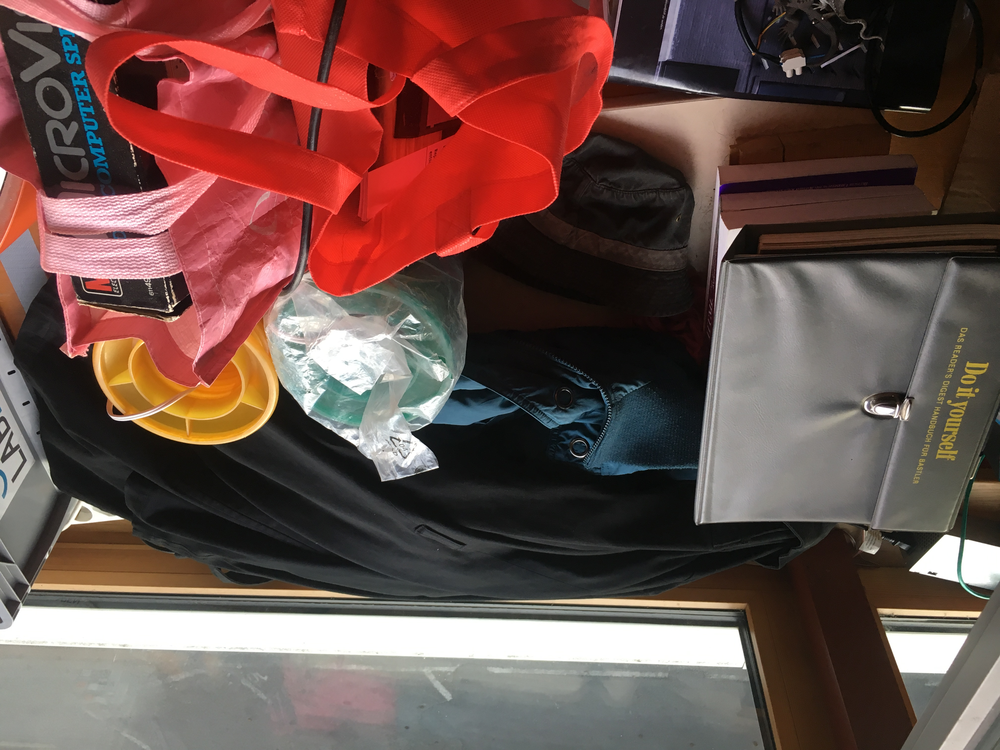{ width=50% }

- Init: Ende Juni 2019
- Freeze: 8.7.2019
- Free For All: 20.7.2019
- Sperrmüll kommt: 6.8.2019 (am Tag davor rausstellen!)

{ width=50% }
{ width=50% }
{ width=50% }
{ width=50% }

### Ende 2017

- Init: Oktober 2017
- Freeze: 07.11.2017
    - 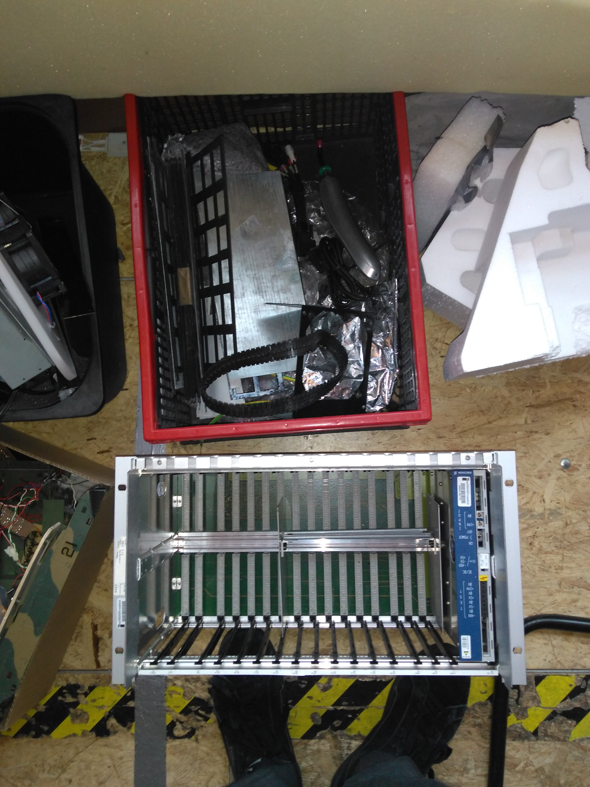
    - 
    - 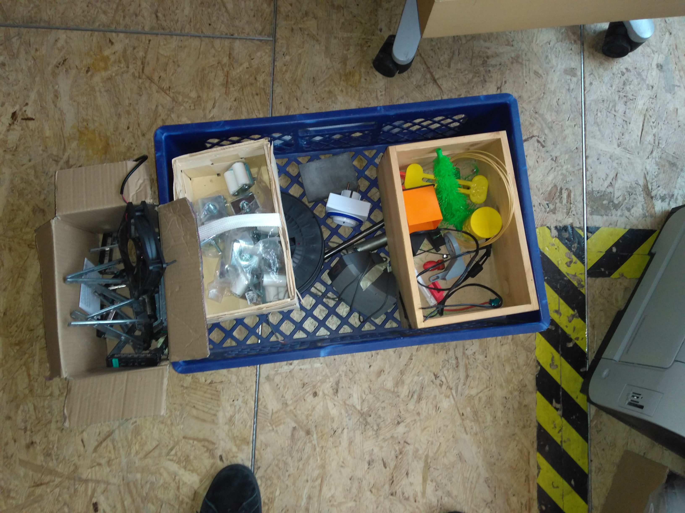
    - 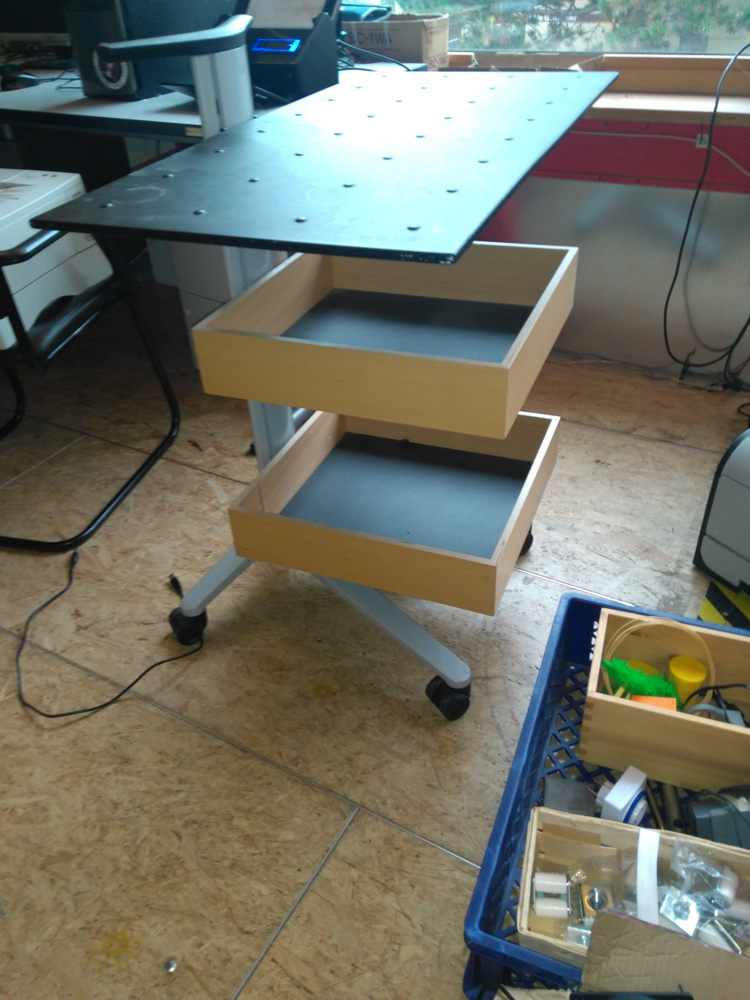
- Free For All: 18.11.2017
- Scrap: 29.11.2017

### Januar - April 2017

- Init: 21.01.2017 (Init mitsamt allem, was schon drauf war)
- Garbage Collect am 26.1.2017 (wg. offensichtlichen Platzproblemen)
	- Zwei „Upcycling-Material“-Kisten gemerged
	- Müll entfernt, Kartons entfernt
- **Dinge dürfen draufgelegt werden bis zum Freeze am 27.01.2017**
- Owner dürfen Dinge entnehmen bis zum Free for All am 20.02.2017
- Dinge werden dann entsorgt am Scrap zum 15.03.2017

#### Inhalt des Haufens am 26.1.2017

{ width=70% }

{ width=35% }

{ width=70% }

{ width=70% }

{ width=70% }

{ width=70% }

{ width=70% }

Weiteres:

- Schachtisch aus Holz ohne Figuren
- Diverse Decken/Kissen, relativ ekelhaft
- Pappkarton mit Energiesparlampen

### Ende 2016

- Init: 31.10.2016
- Dinge dürfen draufgelegt werden bis zum Freeze am 16.11.2016
- Owner dürfen Dinge entnehmen bis zum Free for All am 23.11.2016
- Dinge werden dann entsorgt am Scrap zum 01.12.2016

## Ort

Markiert mit Klebeband am Boden.

## Verschiedene Status des Haufens

Der Haufen hat zu jedem Zeitpunkt einen Zustand.

Der Haufen kann in 3 Zuständen sein und geht nach festgelegten Zeiten vom aktuellen Zustand in den nächsten über:

1. Init
    * Drauflegen: erlaubt
    * Nehmen: verboten
    * Dauer: keine Feste, Zustand endet nach Ankündigung von Menschen
2. Freeze
     * Drauflegen: verboten
     * Nehmen: Eigentümer dürfen ihren Kram nach Hause mitnehmen
     * Dauer: 1,5 Wochen
3. Free For All
     * Drauflegen: verboten
     * Nehmen: erlaubt für alle
     * Dauer: 1,5 Wochen
4. Scrap: Entsorgung nach Durchlaufen der anderen Status

Optional:

- Garbage Collect
    - Entsorgung offensichtlichen Mülls
    - Sinnvoll, wenn der Haufen zu viel Platz einnimmt
    - Umräumen, Kompression
