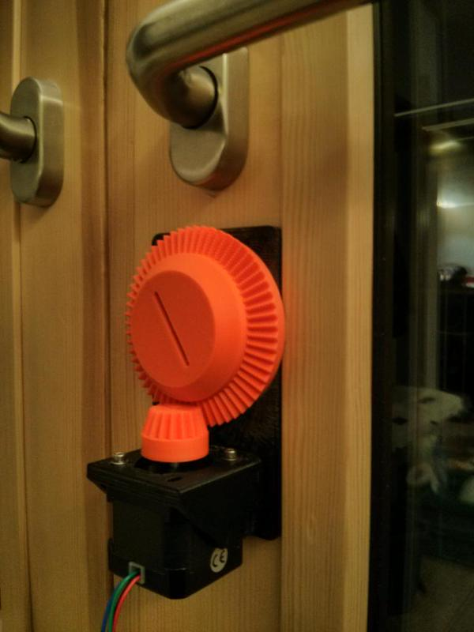

Dieser Artikel behandelt Sphincter 2.0, die Schliessanlage des Labors 2.0. Die Neuauflage war nötig, weil im Labor 2.0 eine Paniktür verbaut wurde, die sich auch im abgeschlossenen Zustand von innen öffnen lässt. Außerdem wurden einige Kinderkrankheiten der alten Version beseitigt. Die alte Version ist [hier](Sphincter%201.0) dokumentiert.

Firmware und Schaltplan gibts [hier](https://github.com/phil-underscore/sphincter2.0).

## Anforderungen an das neue System
* funktioniert mit Paniktüren (Auf- und Zuschließen mit jeweils einer Vierteldrehung, Aufsperren durch Herunterdrücken der Klinke)
* bei einer Fehlfunktion muss von außen mit einem normalen Schlüssel gesperrt werden können
* fail-safe: Das System darf unter keinen Umständen die Tür blockieren können.
* Verwendung mehrerer Zugangskontrollsysteme (sprich: Signalgeber) gleichzeitig
* Notversorgung bei Stromausfall und galvanische Trennung von allen anderen Laborsystemen

## Technik

### Hardware

Um die neuen Anforderungen zu erfüllen musste der Türöffner von [Sphincter 1.0](Sphincter_1.0) von Grund auf neu entwickelt werden. Er besteht jetzt aus einer 3D-gedruckten Platte, die auf den Schließzylinder von innen aufgesetzt wird. Darauf befindet sich ein Zahnrad, in das der Schlüssel eingesetzt wird. Angetrieben wird es über einen Schrittmotor, die Positionsbestimmung erfolgt über einen Reed-Kontakt in der Grundplatte und einen Magneten im Zahnrad.

Auf der Steuerplatine ist ein ATmega8 verbaut. Die galvanische Trennung von anderen Laborsystemen wurde über Optokoppler realisiert. Außerdem gibt es noch einen 12V Bleiakku mit Ladegerät und Spannungsüberwachung um auch bei einem ausgelösten FI noch Zugang zu den Räumen zu haben.

### Interface

Der Türöffner verfügt über zwei getrennte, optisch isolierte Interfaces. Jedes Interface hat 6 Pins: Vcc, GND, lock, unlock, status0 und status1.

Über die lock/unlock-Leitungen wird die Tür ab- und aufgesperrt. Die Steuerung erwartet hier ein mindestens 1.5ms langes active-high Signal. Der Pegel ist unkritisch (mind. 2V wegen des Optokopplers). status0/status1 sind zwei open collector Ausgänge. Auf der Steuerplatine sind bereits Pullup-Widerstände vorgesehen; um sie zu nutzen muss Vcc angeschlossen werden. Möchte man die Pullups nicht benutzen muss Vcc unbelegt bleiben.

Steckerbelegung:

<table>
<tr><td>Vcc</td> <td>status0</td></tr>
<tr><td>status1</td><td>lock</td></tr>
<tr><td>unlock</td><td>GND</td></tr>
</table>

Das Steuergerät kennt im Moment drei Statuszustände:

<table>
<thead>
  <tr class="header"><th>Zustand</th><th>status0</th><th>status1</th></tr>
</thead>
<tr><td>error</td><td>High</td><td>High</td></tr>
<tr><td>aufgesperrt</td><td>High</td><td>Low</td></tr>
<tr><td>zugesperrt</td><td>Low</td><td>High</td></tr>
</table>

Außerdem gibt es noch drei Status-LEDs auf der Platine und an der Tür:

<table>
 <thead>
  <tr class="header">
   <th>Status</th>
   <th>rot (Platine)</th>
   <th>gelb</th>
   <th>blau</th>
  </tr>
 </thead>
  <tr>
   <td>error</td>
   <td>X</td>
   <td>(blinken)</td>
   <td>(blinken)</td>
  </tr>
  <tr>
   <td>aufgesperrt</td>
   <td>X</td>
   <td>aus</td>
   <td>ein</td>
  </tr>
  <tr>
   <td>Türe offen</td>
   <td>X</td>
   <td>aus</td>
   <td>(blinken)</td>
  </tr>
  <tr>
   <td>zugesperrt</td>
   <td>X</td>
   <td>ein</td>
   <td>aus</td>
  </tr>
  <tr>
   <td>automatisches Zusperren</td>
   <td>X</td>
   <td>(blinken)</td>
   <td>aus</td>
  </tr>
  <tr>
   <td>Akkuspannung niedrig</td>
   <td>(blinken, langsam)</td>
   <td>X</td>
   <td>X</td>
  </tr>
  <tr>
   <td>Akkuspannung kritisch</td>
   <td>(blinken, schnell)</td>
   <td>X</td>
   <td>X</td>
  </tr>
</table>

## Bedienung

### Bedienung von außen

Die Steuerung des Sphincters von außen basiert auf einem HTTPS-Service, der aus dem internen Netzwerk (WLAN) des OpenLabs erreichbar ist. Dieser Service läuft auf `https://labctl.openlab-augsburg.de/sphincter` (der DNS-Eintrag zeigt auf eine interne IP-Addresse).

Der Service erwartet HTTP-Request nach folgender Form: `https://labctl.openlab-augsburg.de/sphincter?action=<action>&token=<token>`

Hierbei ist das Token ein zufälliger String, den man als virtuellen Schlüssel zum OpenLab bekommt, und action ist entweder:

* `state`: Gibt `OPEN` bzw. `CLOSED` für den jeweils aktuellen Zustand des Schlosses zurück
* `open`: Öffnet die Tür bei korrektem Token
* `close`: Schließt die Tür bei korrektem Token

Die einfachste Möglichkeit ist also einfach die Tür mit dem Browser oder `curl` zu steuern, es sind aber Clients aller Arten denkbar.

### Clients

* [Trigger-Android-App](https://github.com/mwarning/trigger) - Trigger is an Android App to unlock/lock doors, show the door status and ring a bell.
* [Sphincter-Android-App](https://github.com/openlab-aux/sphincter-remote/releases) ([Source Code](https://github.com/openlab-aux/sphincter-remote/))

### Bedienung von innen

Wenn ihr den Türöffner aus irgend einem Grund von innen manuell bedienen müsst, müsst ihr die Abdeckung am Elektronikgehäuse aufklappen. Dort befinden sich jeweils ein Taster für einen Systemreset und das Auf-/Zuschließen.

Wenn ihr das Labor als letzter verlasst und nicht über euer mobiles Endgerät absperren wollt, dann könnt ihr - wie früher - automatisch zusperren lassen. Drückt dafür den Taster an der Tür ca. 1s lang. Die gelbe LED beginnt zu blinken, ihr habt dann 15s Zeit um das Lab zu verlassen.

### Verhalten bei Fehlern

Das System ist so ausgelegt, dass es grundsätzlich jeden Fehler mit einem Absperrvorgang beheben kann. Wenn sich das System im Error-Modus befindet (fehlgeschlagener Absperrversuch oder Systemneustart) führt jedes Kommando zu einer Referenzfahrt. Dabei wird die Tür abgeschlossen und ein neuer Nullpunkt ermittelt. Bei jedem normalen Absperren wird ebenfalls der Nullpunkt neu ermittelt.

Der Unterschied zwischen Referenzfahrt und Absperren besteht darin, dass die Referenzfahrt auch dann einen genauen Nullpunkt ermitteln kann, wenn das Zahnrad so weit verdreht wurde, dass der Endstopp schon ausgelöst hat.

<table>
<thead><tr class="header">
<th>Fehler</th> <th>Symptome</th><th>Lösung</th>
</tr></thead>
<tr>
<td>jemand hat das Zahnrad von Hand verdreht</td> <td>Aufschließen funktioniert nicht mehr</td><td>Zuschließen um eine neue Referenzposition zu finden, dann nochmal aufschließen. In besonders harten Fällen diese Prozedur nochmal wiederholen (nötig, wenn der Endstopp beim Verdrehen ausgelöst hat)</td>
</tr>
<tr>
<td>Tür wurde beim Zusperren nicht zugezogen</td> <td>Tür wurde nicht abgeschlossen, Sphincter ist im Error-Modus: beide LEDs blinken</td><td>Auf- oder Zusperren, um eine neue Referenzfahrt auszulösen. Dabei Tür unbedingt zuziehen!</td>
</tr>
<tr>
<td>Tür wurde beim Aufsperren nicht zugezogen</td> <td>Tür öffnet sich nicht (auch nicht, wenn sie danach zugezogen wird), Motor überspringt Schritte und hat seine Position verloren</td><td>Zuschließen um eine neue Referenzposition zu finden, dann nochmal aufschließen</td>
</tr>
<tr>
<td>sphincter ist im Error-Modus</td> <td>beide LEDs blinken</td><td>irgend ein Kommando geben und Tür zuziehen um eine Referenzfahrt auszulösen</td>
</tr>
</table>
## Source Code und Schaltpläne

Der Source Code ist relativ wild verteilt, was schon mehrfach für Verwirrung gesorgt hat. Man sollte das [mal™ ändern](https://github.com/openlab-aux/orgafoo/issues/225).

Folgende Repositories enthalten relevantes:

* Android-Client: [sphincter-remote](https://github.com/openlab-aux/sphincter-remote)
* Control daemon (stellt die HTTPS-API bereit): [sphincterd](https://github.com/openlab-aux/sphincterd)
* CAD für die 3D-gedruckten Teile: [sphincter-cad](https://github.com/openlab-aux/sphincter2-cad)
* Firmware für den Mikrocontroller: [sphincter2.0](https://github.com/openlab-aux/sphincter2.0) (bzw. ursprüngliches Repository [hier](https://github.com/phil-underscore/sphincter2.0))
